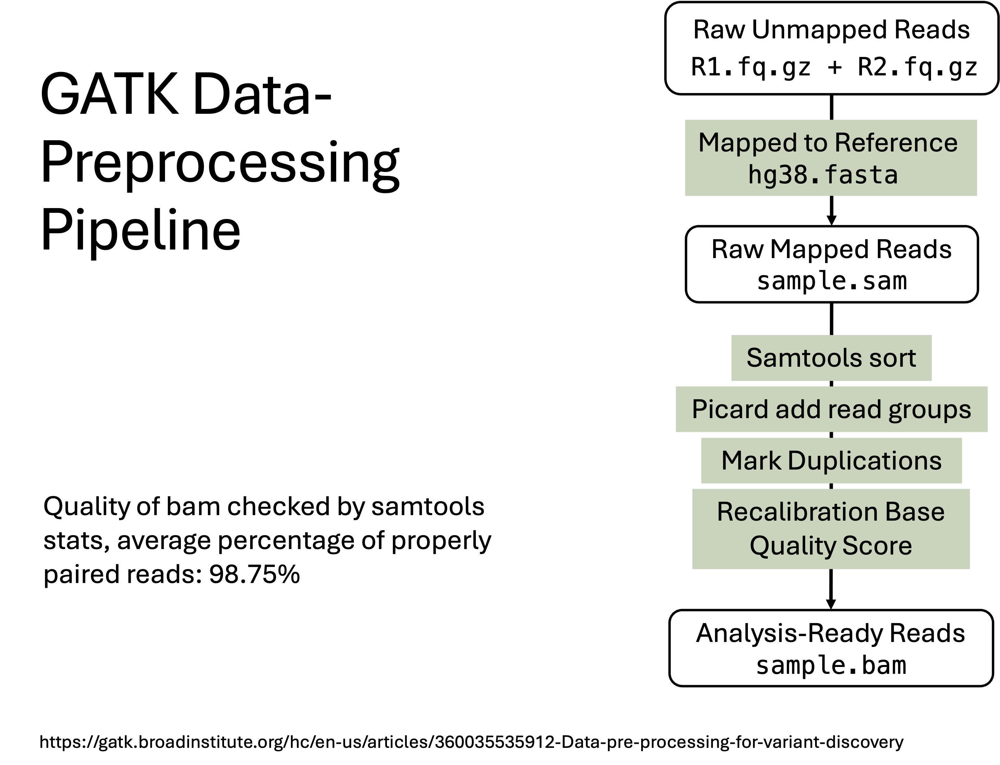
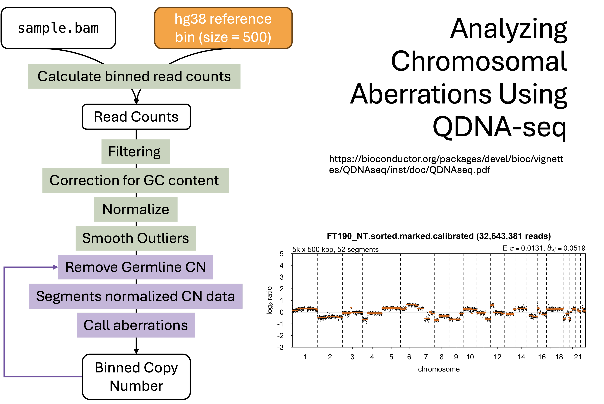

# Shallow Whole Genome Sequencing (sWGS) Analysis Pipeline      
Tumour Evolution      

### Technology Introduction    
Shallow Whole Genome Sequencing (sWGS) is a cost-effective method for detecting genome-wide copy number variations (CNVs) at low coverage (typically 0.1-1x). This technique quantifies DNA sequence read depth in fixed genomic bins to identify chromosomal gains/losses, making it ideal for cancer genomics studies where large-scale CNVs are key drivers of disease. This repository implements a complete sWGS analysis pipeline from raw sequencing data to CNV detection.      

---

### Pipeline Overview
The analysis consists of three integrated stages:

<p align="center">
    
</p>

<p align="center">
    
</p>

#### 1. Alignment & Preprocessing (`alignment.sh`)
- **Input**: Paired-end FASTQ files
- **Steps**:
  - Alignment to hg38 reference genome using `bwa mem`
  - SAM sorting and read group addition with Picard
  - Duplicate marking/removal
  - BAM indexing with Samtools
- **Output**: Analysis-ready BAM file
- **Quality Control**: 98.75% properly paired reads (via Samtools stats)

#### 2. Base Quality Recalibration (`recalibration.sh`)
- **Input**: Processed BAM from Stage 1
- **Steps**:
  - Base quality score recalibration using GATK's `BaseRecalibrator`
  - Known variant resources: 
    - `Homo_sapiens_assembly38.known_indels.vcf.gz`
    - `Mills.indels.contig.adjusted.hg38.vcf.gz`
    - `Homo_sapiens_assembly38.dbsnp138.vcf.gz`
  - Apply recalibration with `ApplyBQSR`
- **Output**: Recalibrated BAM file


#### 3. CNV Analysis with QDNAseq (`qdnaseq.R`)
- **Input**: Recalibrated BAM files
- **Steps**:
  1. Bin read counts (1kbp bins)
  2. Filter bins (residual/blacklist)
  3. GC-content correction and normalization
  4. Segmentation and CNV calling
  5. Germline CNV removal using reference sample
  6. Visualization and export of results
- **Outputs**:
  - CNV profiles (PNG images)
  - Processed data (TXT, BED, IGV, VCF, SEG formats)
  - R workspace (`image.RData`)

---

### Directory Structure
```
Project/
├── data/
│   ├── BAM/               # Processed BAM files
│   ├── FASTQ/             # Raw sequencing data
│   ├── QDNAseq/           # Per-sample CNV results
│   │   └── <SAMPLE_ID>/   # Sample-specific outputs
│   ├── sample_id.txt      # Sample IDs (one per line)
│   └── reference_cn_unnormalised.txt # Reference CN profile
├── scripts/
│   ├── alignment.sh       # Alignment pipeline
│   ├── recalibration.sh   # Recalibration script
│   └── qdnaseq.R          # CNV analysis
└── results/               # Final outputs (optional)
```

---

### Key Biological Findings
Analysis of TP53-knockout ovarian cancer cell lines revealed:
- **Untreated cells**:
  - Chromosome 2p/7q/8/9p/11q/15q/20p amplifications
  - 1q/7p/10q/12p/17p/18 deletions
- **Reversine-treated cells**:
  - Distinct CNV profiles with treatment-specific alterations
  - Recurrent 1q deletions and 4p/8p/11q/15q amplifications
  - Sample H9 showed 5q deletion and 18q loss (example below):


---

### Dependencies
| Tool          | Version       | Purpose                     |
|---------------|---------------|----------------------------|
| BWA           | ≥0.7.17       | Read alignment             |
| Picard        | 3.2.0         | BAM processing             |
| Samtools      | ≥1.10         | BAM indexing/QC            |
| GATK          | 4.2.0.0       | Base recalibration         |
| R             | ≥4.0          | Statistical analysis       |
| QDNAseq       | 1.30.0        | CNV detection              |
| QDNAseq.hg38  | 1.0.0         | hg38 bin annotations       |

---

### Execution Workflow
1. **Preprocessing**:
```bash
# Set environment variables
export REF=/path/to/references
export SEQ_1=sample_R1.fastq.gz
export SEQ_2=sample_R2.fastq.gz
export sample_id=SAMPLE_NAME

# Run alignment pipeline
bash scripts/alignment.sh
```

2. **Recalibration**:
```bash
bash scripts/recalibration.sh
```

3. **CNV Analysis**:
```R
# In R:
source("scripts/qdnaseq.R")
```

---

### References
1. Scheinin I, Sie D, Bengtsson H, van de Wiel MA, Olshen AB, van Thuijl HF, van Essen HF, Eijk PP, Rustenburg F, Meijer GA, Reijneveld JC, Wesseling P, Pinkel D, Albertson DG, Ylstra B. DNA copy number analysis of fresh and formalin-fixed specimens by shallow whole-genome sequencing with identification and exclusion of problematic regions in the genome assembly. Genome Res. 2014 Dec;24(12):2022-32. doi: 10.1101/gr.175141.114. Epub 2014 Sep 18. PMID: 25236618; PMCID: PMC4248318.        
2. Mermel CH, Schumacher SE, Hill B, Meyerson ML, Beroukhim R, Getz G. GISTIC2.0 facilitates sensitive and confident localization of the targets of focal somatic copy-number alteration in human cancers. Genome Biol. 2011;12(4):R41. doi: 10.1186/gb-2011-12-4-r41. Epub 2011 Apr 28. PMID: 21527027; PMCID: PMC3218867.
3. GATK Best Practices: [Data Pre-processing for Variant Discovery](https://gatk.broadinstitute.org/hc/en-us/articles/360035535912-Data-pre-processing-for-variant-discovery)


